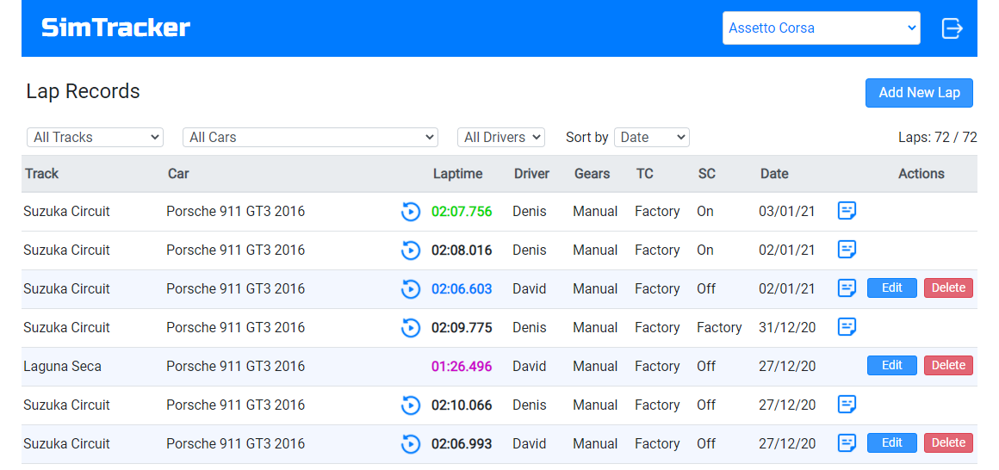
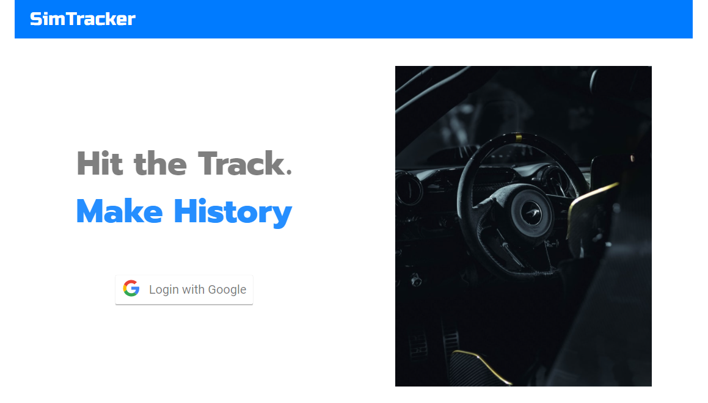
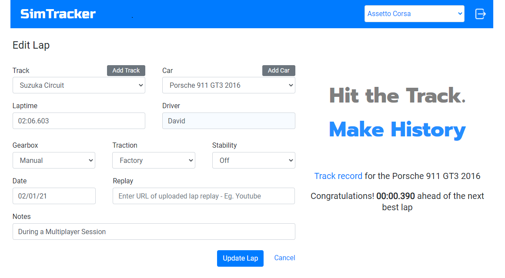
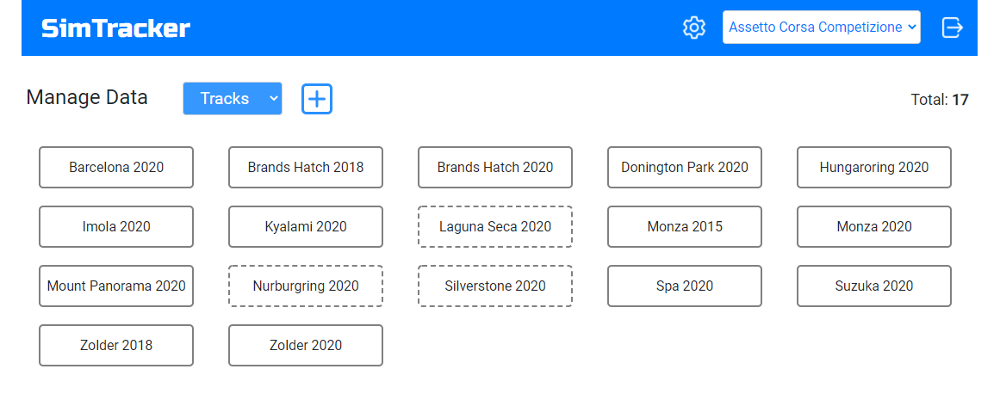

# sim-tracker

Sim Racing Laptime Tracking Application [NextJS, Typescript, MongoDB, Next-Auth]

---

## Getting Started

First, install the dependencies:

### `yarn`

Then, run the development server:

### `yarn dev`

Open [http://localhost:3000](http://localhost:3000) with your browser to see the login screen.

---

SimTracker is a web application that stores and displays Laptimes, along with Notes and Video Replay links, for comparison between drivers. When multiple Driver's laps are shown, the current user's laps are highlighted for easy reference.

---

Access to the app is provided to authorised users only, who can login using Google OAuth with a single click.

---

An authorised user can both Add new laps (along with new Cars and Tracks), as well as Edit any of their existing lap entries.

---

An admin mode is included for managing track, car, driver and sims/game records. Only items with no related laps can be deleted.

